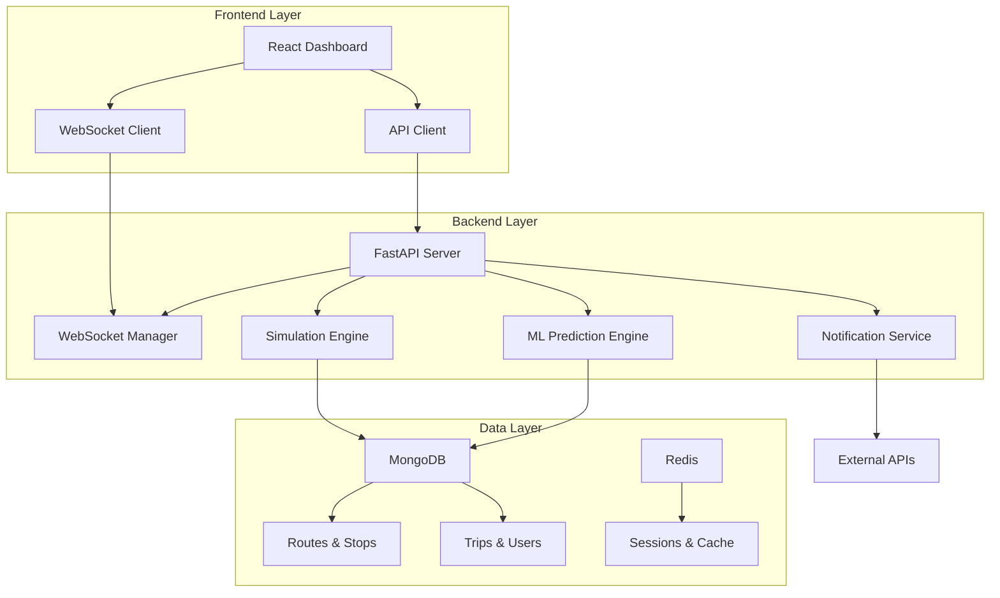

# 🚌 BusNotify - Software-Only Bus Delay Prediction System

[](https://opensource.org/licenses/MIT)
[](https://www.python.org/downloads/)
[](https://reactjs.org/)
[](https://fastapi.tiangolo.com/)

A comprehensive, software-only bus delay prediction and real-time passenger notification system that simulates bus movement without GPS hardware. Built with modern technologies and designed for scalability.

## 🎯 Features

### 🚍 Core Functionality
- **Real-time Bus Simulation** - GPS-free movement simulation using time-step approach
- **Delay Prediction** - ML-powered delay forecasting with confidence scores
- **Live Tracking** - WebSocket-based real-time position updates
- **Smart Notifications** - Multi-channel alerts (Email, SMS, Push, Web)
- **Route Management** - Comprehensive route and stop management
- **User Subscriptions** - Personalized route notifications

### 🧠 Advanced Features
- **Machine Learning** - Historical data analysis and predictive modeling
- **Route Deviation Detection** - Automatic detection of off-route buses
- **Emergency Broadcasts** - System-wide alert capabilities
- **Admin Dashboard** - Complete system management interface
- **Analytics** - Performance metrics and usage analytics
- **Mobile PWA** - Progressive Web App for mobile users

### 🔧 Technical Highlights
- **Microservices Architecture** - Scalable, containerized services
- **Real-time Communication** - WebSocket-based live updates
- **Modern UI/UX** - Responsive design with accessibility features
- **API-First Design** - RESTful APIs with OpenAPI documentation
- **Cloud-Ready** - Docker containers with orchestration support

## 🏗️ Architecture



## 🚀 Quick Start

### Using Docker (Recommended)

1. **Clone the repository**
```bash
git clone https://github.com/S-Rahul-Naik/BusNotify.git
cd BusNotify
```

2. **Start all services**
```bash
docker-compose up -d
```

3. **Access the application**
- 🌐 **Frontend**: http://localhost:3000
- 🔌 **Backend API**: http://localhost:8000
- 📚 **API Docs**: http://localhost:8000/docs
- 🗄️ **MongoDB**: localhost:27017

### Manual Setup

#### Prerequisites
- Python 3.11+
- Node.js 18+
- MongoDB 7.0+
- Redis 7.0+

#### Backend Setup
```bash
cd backend
pip install -r requirements.txt
cp .env.example .env  # Configure your environment
uvicorn main:app --reload
```

#### Frontend Setup
```bash
npm install
npm run dev
```

## 📱 Usage

### For Passengers
1. **Register/Login** - Create account or sign in
2. **Browse Routes** - Explore available bus routes
3. **Subscribe** - Get notifications for your routes
4. **Track Buses** - View real-time bus locations
5. **Receive Alerts** - Get delay and arrival notifications

### For Administrators
1. **Manage Routes** - Add, edit, or remove bus routes
2. **Monitor System** - View system health and metrics
3. **Send Alerts** - Broadcast emergency messages
4. **Analyze Data** - Review performance analytics
5. **User Management** - Manage user accounts and permissions

## 🛠️ API Documentation

### Authentication
```bash
# Register new user
POST /api/v1/auth/register
{
  "email": "user@example.com",
  "password": "securepassword",
  "name": "John Doe"
}

# Login
POST /api/v1/auth/login
{
  "email": "user@example.com",
  "password": "securepassword"
}
```

### Routes & Stops
```bash
# Get all routes
GET /api/v1/routes

# Get route details
GET /api/v1/routes/{route_id}

# Get stops for route
GET /api/v1/routes/{route_id}/stops
```

### Real-time Data
```bash
# Get active trips
GET /api/v1/trips/active

# Get trip predictions
GET /api/v1/predictions/trip/{trip_id}
```

Full API documentation available at `/docs` when running the server.

## 🧪 Testing

### Backend Tests
```bash
cd backend
pytest tests/ -v --cov=app
```

### Frontend Tests
```bash
npm test
npm run test:e2e
```

### Integration Tests
```bash
docker-compose -f docker-compose.test.yml up --abort-on-container-exit
```

## 🚀 Deployment

### Docker Production
```bash
docker-compose -f docker-compose.prod.yml up -d
```

### Cloud Deployment
- **AWS**: Use ECS/EKS with RDS and ElastiCache
- **GCP**: Deploy on Cloud Run with Cloud SQL
- **Azure**: Use Container Instances with Cosmos DB

See [DEPLOYMENT.md](./DEPLOYMENT.md) for detailed deployment guides.

## 🔧 Configuration

### Environment Variables

#### Backend (.env)
```bash
# Database
MONGODB_URL=mongodb://localhost:27017/busnotify
REDIS_URL=redis://localhost:6379

# Security
SECRET_KEY=your-secret-key-here
ALGORITHM=HS256

# External APIs
SENDGRID_API_KEY=your-sendgrid-key
TWILIO_ACCOUNT_SID=your-twilio-sid
```

#### Frontend (.env)
```bash
VITE_API_URL=http://localhost:8000/api/v1
VITE_WS_URL=ws://localhost:8000
```

## 📊 Monitoring

The system includes comprehensive monitoring:

- **Health Checks** - `/health` endpoint for service status
- **Metrics** - Prometheus-compatible metrics
- **Logging** - Structured JSON logging
- **Alerts** - Configurable alerting rules

## 🤝 Contributing

We welcome contributions! Please see [CONTRIBUTING.md](./CONTRIBUTING.md) for guidelines.

### Development Setup
1. Fork the repository
2. Create a feature branch
3. Make your changes
4. Add tests for new features
5. Submit a pull request

### Code Style
- **Backend**: Black, isort, mypy
- **Frontend**: ESLint, Prettier
- **Commits**: Conventional Commits format

## 📋 Roadmap

### Phase 1: Core System ✅
- [x] Backend infrastructure
- [x] Database design
- [x] Basic simulation engine
- [x] API framework

### Phase 2: Frontend & ML 🚧
- [ ] Interactive dashboard
- [ ] Map integration
- [ ] ML prediction models
- [ ] Real-time updates

### Phase 3: Advanced Features
- [ ] Mobile app
- [ ] Advanced analytics
- [ ] Multi-city support
- [ ] API marketplace

### Phase 4: Enterprise
- [ ] White-label solution
- [ ] Advanced integrations
- [ ] Custom deployment options

## 📄 License

This project is licensed under the MIT License - see the [LICENSE](LICENSE) file for details.

## 🙏 Acknowledgments

- **FastAPI** for the excellent async web framework
- **React** team for the powerful frontend library
- **MongoDB** for the flexible document database
- **OpenStreetMap** for geographical data
- **Contributors** who helped build this system

## 📞 Support

- 📧 **Email**: support@busnotify.com
- 💬 **Discord**: [Join our community](https://discord.gg/busnotify)
- 📖 **Documentation**: [docs.busnotify.com](https://docs.busnotify.com)
- 🐛 **Issues**: [GitHub Issues](https://github.com/S-Rahul-Naik/BusNotify/issues)

---

**Built with ❤️ for better public transportation**